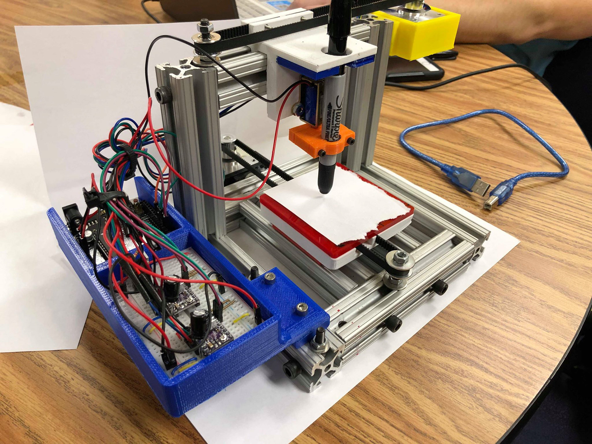
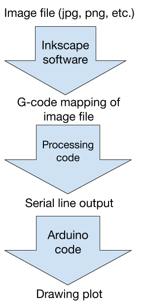

This project served as the capstone to my semester in the Product Design course. We were tasked with designing a system that can control 2.5 axes: two axes with a full range of motion, and 1 axis with simple on/off motion control, e.g. a solenoid. We designed a plotting robot that would be able to plot any simple image.

## The Big Picture

The prototype we designed has many similarities to a CNC router. CNC routers have 3 fully controlled axes and use a cutting tool instead of a pen, but the general mechanical design principles and control systems used are very similar. Nearly every aspect of engineering involves electro-mechanical design, where some sort of electrical or computer system is used to control a mechanical system. Consider the previously mentioned CNC router, a 3-D printer, or even a self-driving car. All of these systems require very precise control of a mechanical system through an electrical system. Being able to properly manage constraints like queue times, motor stalling, etc. can go a long way toward making a system run smoothly.

 

To plot using our prototype, we used the program flow demonstrated in the image below. First, an image was loaded into the program Inkscape, an open-source platform which provides a wide range of editing tools. Using Inkscape, the image was converted into a vector path, which was then converted into a g-code program that could be read by our plotter. The g-code file was then opened by our code running in Processing, a programming platform that allows for serial communication between a PC and an Arduino. The code we used sent the g-code one line at a time to the Arduino through the serial monitor, waited until that line had finished executing, then sent the next line. The g-code sent to the Arduino was read and interpreted by our Arduino code, which moved the motors and solenoid to draw the requested image.
